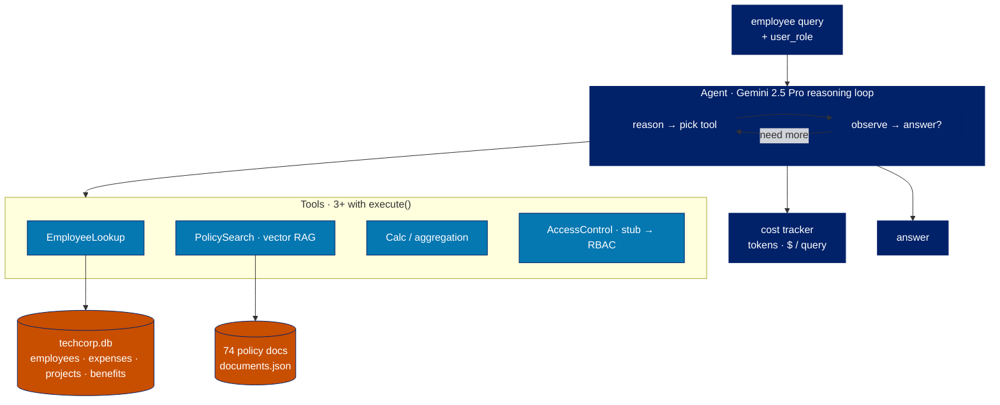

# AIPI 561 · LLMOps — TechCorp Knowledge Assistant


[](LICENSE)

Duke MEng · AIPI 561 (Summer 2026) — Project 2 of the course. An enterprise RAG assistant: a reasoning agent answers employee questions over a deliberately messy corporate corpus (a 10K-employee SQLite database + 74 policy documents), combining LLM tool-use with retrieval — securely, affordably, reliably. Built in three stages: the agent, then access control + monitoring, then cost optimization. Companion to Project 1 (MLOps), [`aipi561-mlops`](https://github.com/jonasneves/aipi561-mlops).

Starter + dataset: [`Ops-AI-Student/week5`](https://github.com/AIPI-561-Operationalizing-AI/Ops-AI-Student/tree/main/week5).

## Architecture



## The system

- **Agent** — a Gemini 2.5 Pro reasoning loop: the LLM picks a tool, observes the result, then loops or synthesizes an answer.
- **Tools** — SQLite lookups (employees, expenses, projects, benefits), policy-document retrieval via vector search, calculations/aggregations, and access-control filtering (`user_role`-aware).
- **Cost tracking** — token and dollar accounting per query.
- **Deploy** — Google Kubernetes Engine (shares the Project-1 cluster).

## Run

```bash
cp .env.example .env          # add GOOGLE_API_KEY — aistudio.google.com/app/apikey
pip install -r requirements.txt
python app_starter.py
```

`app_starter.py` and `data/` come from the [course starter](https://github.com/AIPI-561-Operationalizing-AI/Ops-AI-Student/tree/main/week5); the dataset is git-ignored (large).

## Layout

```
.
├── app_starter.py     agent + tools
├── data/              techcorp.db + policy docs  (git-ignored)
├── requirements.txt
└── .env.example       GOOGLE_API_KEY
```
